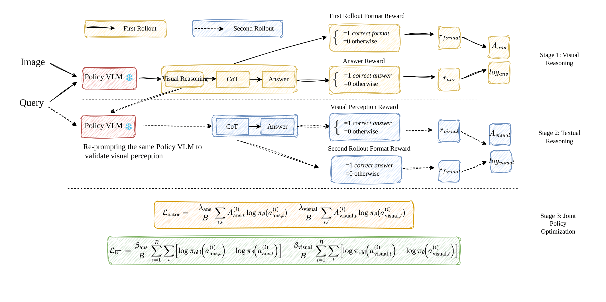
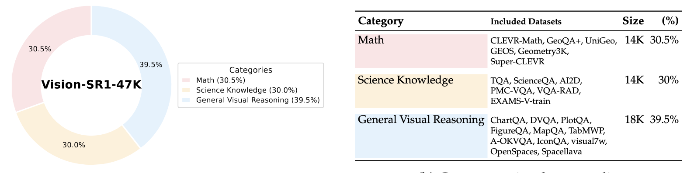
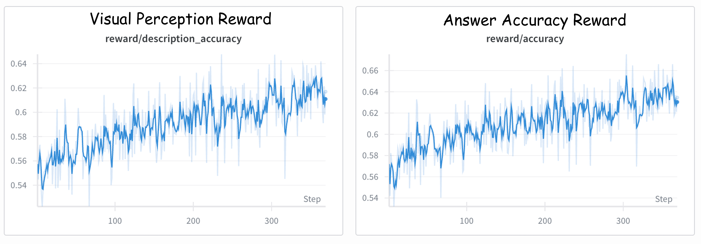

## Vision-SR1: Self-Rewarding Vision-Language Model via Reasoning Decomposition

[[📖 Paper](---)]  

**Models:**  
[🤗 Vision-SR1-7B](https://huggingface.co/LMMs-Lab-Turtle/SelfRewarded-R1-7B) | 
[🤗 Vision-SR1-7B-Cold-Start](https://huggingface.co/LMMs-Lab-Turtle/Qwen-2.5VL-7B-Cold-Start) 

**Datasets:**  
[📊 Vision-SR1-Cold-Start-9K](https://huggingface.co/datasets/LMMs-Lab-Turtle/Vision-SR1-Cold-9K)  | 
[📊 Vision-SR1-47K](https://huggingface.co/datasets/LMMs-Lab-Turtle/Vision-SR1-47K) 


**Training Curves:**  
[📈 Vision-SR1](https://api.wandb.ai/links/zli12321-university-of-maryland/85ed11ft) 

---

## 👀 About Vision-SR1

Vision-SR1 is a self-rewarded RL training framework to decompose VLMs' language reasoning into visual perception reasoning and language reasoning. Inspired by the awesome works of e.g. Vision-R1, Visionary-R1, R1-VL, we leverage VLM's self evolving and reasoning ability to **Reward Itself**. 

Because VLMs fuse the vision encoder with the LLM backbone only late in pretraining, they often rely primarily on language reasoning rather than visual perception. Standard RL training tends to **recall prior language knowledge** for accuracy gains while **neglecting vision**. External LLM-based perception rewards can help but introduce bias and heavy latency. We instead propose a self-reward framework, enabling the model to provide its own visual and reasoning feedback with **no latency**.

Besides vision decomposition, We constructed two datasets: **Vision-SR1-Cold-9K** for SFT and **Vision-SR1-47K** for RL.

<p align="center">
    
</p>

### 🔍 Dataset
Our training dataset is sourced from 23 sources and evenly split across three main areas -- general visual understanding, science knowledge, multimodal mathematical reasoning.

<p align="center">
    
</p>

### New Features:
-- Supports Lora Training. Results are not verified.
-- Support Qwen3-VL series. However, Qwen3 series format reward is always 0. (Pending debug.)
-- Separate advantage computation for final answer accuracy and visual description accuracy.

## Requirements

The code base adopted from [verl](https://github.com/volcengine/verl) and [EasyR1](https://github.com/hiyouga/EasyR1).

### Software Requirements

- Python 3.9+
- transformers=4.49.0

### Setup
```bash
git clone https://github.com/zli12321/Vision-SR1.git
cd Vision-SR1
conda create -n Vision-SR1 python=3.12
bash setup.sh
```


## Training

We support both full fine-tuning and LoRA fine-tuning for two training modes:

- **Vision-R1**: Standard GRPO with accuracy reward (`<think>...\boxed{}` format).
- **Vision-SR1**: Self-reward GRPO with accuracy + self-generated perception reward (`<description>...<think>...\boxed{}` format).

### Full Fine-Tuning

```bash
# Vision-SR1 (Self-Reward) full fine-tuning
bash ./vision_sr1/train.sh

# Vision-R1 (standard accuracy) full fine-tuning
bash ./vision_r1/train.sh
```

- Checkpoints are saved to `./saves/7b_grpo_self_reward/` and `./saves/7b_grpo_accuracy/` respectively.

- To use Qwen3-VL, simply change the model name in train.sh file.

### LoRA Fine-Tuning

```bash
# Vision-SR1 LoRA fine-tuning
bash ./vision_sr1_lora/train.sh

# Vision-R1 LoRA fine-tuning
bash ./vision_r1_lora/train.sh
```

LoRA training uses `rank=64`, `lr=1e-5`, and only trains the language model layers (vision tower is excluded via `exclude_modules: .*visual.*`). Checkpoints are saved to `./saves/7b_grpo_self_reward_lora/` and `./saves/7b_grpo_accuracy_lora/` respectively.

### Merge Checkpoints
```bash
python3 scripts/model_merger.py --local_dir CHECKPOINT_SAVE_DIR/global_step_*/actor
```

### Hardware Requirements

\* *estimated*

| Method                   | Bits |    3B   |   7B   |  
| ------------------------ | ---- |  ------ | ------ | 
| GRPO Full Fine-Tuning    |  AMP |  2/4/8 or 8x80GB | 2/4/8 or 8x80GB | 
| GRPO LoRA Fine-Tuning    |  AMP |  2/4/8 or 8x32GB | 2/4/8 or 8x40GB | 

> [!NOTE]
> Use `worker.actor.fsdp.torch_dtype=bf16` and `worker.actor.optim.strategy=adamw_bf16` to enable bf16 training with fewer memory.


## Evaluation

The `evaluation/` folder contains scripts for evaluating checkpoints across multiple benchmarks with automated answer extraction and LLM-based judging.

### Folder Structure

```
evaluation/
├── eval_config.yaml              # Base evaluation config (val_only, greedy decoding)
├── format_prompt/
│   ├── cot_format.jinja           # CoT prompt template (for Vision-R1)
│   └── see_think_format.jinja     # See-Think prompt template (for Vision-SR1)
├── reward_function/
│   └── eval_accuracy.py           # Rule-based accuracy scoring
├── full_rl/
│   ├── eval_vision_r1.sh          # Evaluate full fine-tuned Vision-R1 checkpoints
│   └── eval_vision_sr1.sh         # Evaluate full fine-tuned Vision-SR1 checkpoints
├── lora_rl/
│   ├── eval_vision_r1_lora.sh     # Evaluate LoRA Vision-R1 checkpoints
│   └── eval_vision_sr1_lora.sh    # Evaluate LoRA Vision-SR1 checkpoints
├── llm_judge.py                   # Extract \boxed{} answers, then judge with LLM
└── print_accuracy.py              # Print accuracy table from judgment files
```

### Running Evaluations

#### Full Fine-Tuning Checkpoints

```bash
# Evaluate base model (no checkpoint):
bash evaluation/full_rl/eval_vision_r1.sh

# Evaluate a specific checkpoint:
bash evaluation/full_rl/eval_vision_r1.sh ./saves/7b_grpo_accuracy/global_step_15

# Vision-SR1 variant:
bash evaluation/full_rl/eval_vision_sr1.sh ./saves/7b_grpo_self_reward/global_step_15
```

#### LoRA Checkpoints

```bash
# LoRA checkpoint (required):
bash evaluation/lora_rl/eval_vision_r1_lora.sh ./saves/7b_grpo_accuracy_lora/global_step_15

# Vision-SR1 LoRA:
bash evaluation/lora_rl/eval_vision_sr1_lora.sh ./saves/7b_grpo_self_reward_lora/global_step_15
```

### Evaluation Pipeline

Each evaluation script runs the following three-stage pipeline automatically:

1. **Generate responses**: Run the model on each benchmark dataset with greedy decoding (`temperature=0`), saving all responses to `evaluation/responses/`.

2. **Extract & judge**: `llm_judge.py` extracts the final answer from `\boxed{}` in each response, then sends the extracted answer and the ground truth to an LLM judge (Qwen2.5-14B-Instruct via vLLM) for comparison. Judgments are saved to `evaluation/judgments/`.

3. **Print accuracy**: `print_accuracy.py` aggregates the judgments and prints a per-dataset accuracy table comparing LLM-judge accuracy with the rule-based score.

### Supported Benchmarks

The evaluation scripts include the following datasets (uncomment as needed in the shell scripts):

mmstar, mm-vet, MLLM_test, visnumbench, mmmu_pro_10options, mmmu-pro-vision, hallusionbench, MMMU, MMSI, mathverse, mathvision, mathvista, realWorldQA


## Supervised Finetuning (Cold Start)

The supervised finetuning code is adopted from [LLaMA-Factory](https://github.com/hiyouga/LLaMA-Factory) for easy setup.

### Download the filtered SFT format data
```bash
while ! python download-sft-data.py; do echo "Retrying..."; sleep 5; done
```

### Setup
```bash
conda create -n SFT python=3.11
cd LLaMA-Factory-Cold-Start
pip install -e ".[torch,metrics]" --no-build-isolation

pip install --upgrade huggingface_hub
huggingface-cli login
```

### Training
```bash
FORCE_TORCHRUN=1 llamafactory-cli train examples/train_full/Vision-SR1-Cold-Start.yaml
```

### Troubleshoot
If you still encounter errors after you follow the setup, simply clone the original LLaMA-Factory repo and follow their setup. Download the [dataset](https://huggingface.co/datasets/LMMs-Lab-Turtle/Vision-SR1-Cold-9K/tree/main) and place into the LLaMA-Factory [data folder](https://github.com/hiyouga/LLaMA-Factory/tree/main/data). Place the [Vision-SR1-Cold-Start.yaml](https://github.com/zli12321/Vision-SR1/blob/main/LLaMA-Factory-Cold-Start/examples/train_full/Vision-SR1-Cold-Start.yaml) file into the LLaMA-Factory [SFT training folder](https://github.com/hiyouga/LLaMA-Factory/tree/main/examples/train_full).


## Custom Dataset

Please refer to the example datasets to prepare your own dataset.

- Text dataset: https://huggingface.co/datasets/hiyouga/math12k
- Image-text dataset: https://huggingface.co/datasets/hiyouga/geometry3k
- Multi-image-text dataset: https://huggingface.co/datasets/hiyouga/journeybench-multi-image-vqa


## Reward Progression in Training




## Citation

If you find our works helpful, please cite

```bibtex
@misc{li2025selfrewardingvisionlanguagemodelreasoning,
      title={Self-Rewarding Vision-Language Model via Reasoning Decomposition}, 
      author={Zongxia Li and Wenhao Yu and Chengsong Huang and Rui Liu and Zhenwen Liang and Fuxiao Liu and Jingxi Che and Dian Yu and Jordan Boyd-Graber and Haitao Mi and Dong Yu},
      year={2025},
      eprint={2508.19652},
      archivePrefix={arXiv},
      primaryClass={cs.CV},
      url={https://arxiv.org/abs/2508.19652}, 
}

@article{huang2508self,
  title={Self-evolving reasoning llm from zero data, 2025},
  author={Huang, Chengsong and Yu, Wenhao and Wang, Xiaoyang and Zhang, Hongming and Li, Zongxia and Li, Ruosen and Huang, Jiaxin and Mi, Haitao},
  journal={URL https://arxiv. org/abs/2508.05004}
}

@article{he2025visplay,
  title={Visplay: Self-evolving vision-language models from images},
  author={He, Yicheng and Huang, Chengsong and Li, Zongxia and Huang, Jiaxin and Yang, Yonghui},
  journal={arXiv preprint arXiv:2511.15661},
  year={2025}
}
```

We recommend to also cite the sourcecode work.

```bibtex
@misc{zheng2025easyr1,
  title        = {EasyR1: An Efficient, Scalable, Multi-Modality RL Training Framework},
  author       = {Yaowei Zheng, Junting Lu, Shenzhi Wang, Zhangchi Feng, Dongdong Kuang, Yuwen Xiong},
  howpublished = {\url{https://github.com/hiyouga/EasyR1}},
  year         = {2025}
}
```
