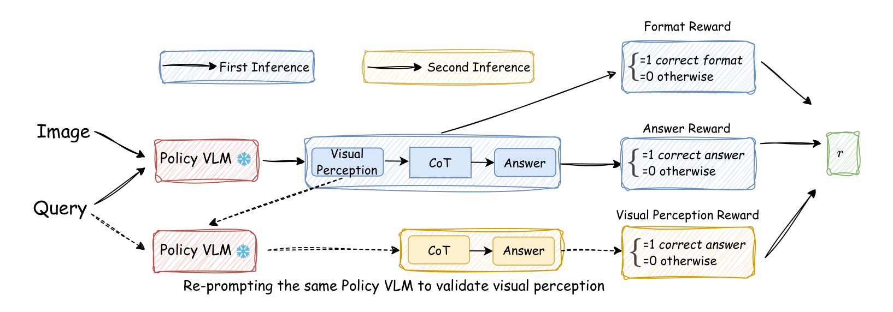

## Vision-SR1: Self-Rewarding Vision-Language Model via Reasoning Decomposition

[[📖 Paper](---)]  

**Models:**  
[🤗 Vision-SR1-7B](https://huggingface.co/LMMs-Lab-Turtle/SelfRewarded-R1-7B) | 
[🤗 Vision-SR1-7B-Cold-Start](https://huggingface.co/LMMs-Lab-Turtle/Qwen-2.5VL-7B-Cold-Start) |
[🤗 Vision-SR1-3B-Cold-Start](https://huggingface.co/LMMs-Lab-Turtle/Qwen-2.5VL-3B-Cold-Start)  

**Datasets:**  
[📊 Vision-SR1-Cold-Start-9K](https://huggingface.co/datasets/LMMs-Lab-Turtle/Vision-SR1-Cold-9K)  | 
[📊 Vision-SR1-47K](https://huggingface.co/datasets/LMMs-Lab-Turtle/Vision-SR1-47K) 


**Training Curves:**  
[📈 Vision-SR1](https://api.wandb.ai/links/zli12321-university-of-maryland/85ed11ft) 

---

LLM evaluation scripts and model generation outputs with LLM judgments is coming, stay tuned!

## 👀 About Vision-SR1

Vision-SR1 is a self-rewarded RL training framework to decompose VLMs' language reasoning into visual perception reasoning and language reasoning. Inspired by the awesome works of e.g. Vision-R1, Visionary-R1, R1-VL, we leverage VLM's self evolving and reasoning ability to **Reward Itself**. 

Because VLMs fuse the vision encoder with the LLM backbone only late in pretraining, they often rely primarily on language reasoning rather than visual perception. Standard RL training tends to **recall prior language knowledge** for accuracy gains while **neglecting vision**. External LLM-based perception rewards can help but introduce bias and heavy latency. We instead propose a self-reward framework, enabling the model to provide its own visual and reasoning feedback with **no latency**.

Besides vision decomposition, We constructed two datasets: **Vsion-SR1-Cold-9K** for SFT and **Vision-SR1-47K** for RL.

<p align="center">
    
</p>


### 🔍 Dataset
Our training dataset is sourced from 23 sources and evenly split across three main areas-- general visual understanding, science knowledge, multimodal mathematical reasoning.

<p align="center">
    
</p>


## Requirements

The code base adopted from [verl](https://github.com/volcengine/verl) and [EasyR1](https://github.com/hiyouga/EasyR1).

### Software Requirements

- Python 3.9+
- transformers=4.49.0

### RL Training Setup
```
git clone https://github.com/zli12321/Vision-SR1.git
cd Vision-SR1
conda create -n Vision-SR1 python=3.11
bash setup.sh
```

### GRPO Training
```
### Self-Reward Vision-SR1 GRPO Training
bash ./train_examples/2-7b_selfReward_train.sh

### Vision-SR1 regular training
bash ./train_examples/1-7b_visionR1_train.sh
```

### Merge checkpoints
```
python3 scripts/model_merger.py --local_dir checkpoints/easy_r1/exp_name/global_step_1/actor
```

### Generating Evaluation Responses
```
bash ./validation_examples/2-seethink_format_eval.sh
```
### Reward Progression in training


### Supervised Finetuning
The supervised finetuning code is adopted from [LLaMA-Factory](https://github.com/hiyouga/LLaMA-Factory) for easy setup.


#### Setup
```
conda create -n SFT python=3.11
cd LLaMA-Factory-Cold-Start
pip install -e ".[torch,metrics]" --no-build-isolation

pip install --upgrade huggingface_hub
huggingface-cli login
```


#### Training
```
FORCE_TORCHRUN=1 llamafactory-cli train examples/train_full/Vision-SR1-Cold-Start.yaml
```

### Hardware Requirements

\* *estimated*

| Method                   | Bits |    3B   |   7B   |  
| ------------------------ | ---- |  ------ | ------ | 
| GRPO Full Fine-Tuning    |  AMP |  4 or 8*40GB | 4 or 8*80GB | 

> [!NOTE]
> Use `worker.actor.fsdp.torch_dtype=bf16` and `worker.actor.optim.strategy=adamw_bf16` to enable bf16 training with fewer memory.


## Custom Dataset

Please refer to the example datasets to prepare your own dataset.

- Text dataset: https://huggingface.co/datasets/hiyouga/math12k
- Image-text dataset: https://huggingface.co/datasets/hiyouga/geometry3k
- Multi-image-text dataset: https://huggingface.co/datasets/hiyouga/journeybench-multi-image-vqa


## Citation

If you find our works helpful, please cite

```bibtex

```

We recommend to also cite the sourcecode work.

```bibtex
@misc{zheng2025easyr1,
  title        = {EasyR1: An Efficient, Scalable, Multi-Modality RL Training Framework},
  author       = {Yaowei Zheng, Junting Lu, Shenzhi Wang, Zhangchi Feng, Dongdong Kuang, Yuwen Xiong},
  howpublished = {\url{https://github.com/hiyouga/EasyR1}},
  year         = {2025}
}
```
